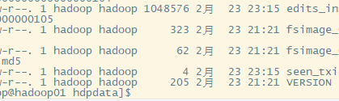
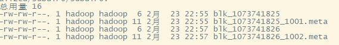
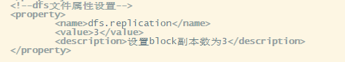

# HDFS 原理

目标缘由：硬件经常错误，寿命短，因此需要冗余也是嵌入了备份多个数据。对大数据进行规模一致性模型，一写入就不能修改，只能删除在重发。

### 1. HDFS体系

* NameNode
* DataNode
* 事务日志
* 映像文件
* SecondaryNameNode


#### 1.1 NameNode

	>名称节点

* 管理文件系统的命名空间
* 记录每个文件数据块在Datanode的位置和副本信息
* 协调客户端对文件的访问
* 记录命名空间的改动和本身属性的改动
* Namenode是用事务日志记录元数据的变化。

> 可以从namenode的你定义保存元数据的目录里看如下：
>
> 
>
> fsimage这就是影响文件

#### 1.2 DataNode

> 数据节点

* 负责物理节点的存储管理
* 一次写入多次读取，不修改
* 文件右数据块组成，典型的大小为64MB
* 数据块散布各个节点

> 数据块文件视图，每个文件都会增长64MB后就不涨了，会增多，会散布在各个集群节点，冗余。
>
> 

### 2. 读取数据流程

* 客户端访问HDFS中的一个文件
* 首先从namenode获得组成文件的数据块位置列表
* 根据列表知道存储数据块的datanode
* 访问datanode获取数据
* Namenode不参与数据实际传输

> 

#### 2.1 冗余副本策略

* 可以在hdfs-site.xml中设置复制因子指定副本数量
* 所以数据块都有副本
* Datanode启动时，遍历本地文件系统，产生一份hdfs数据块和本地文件的对应关系列表（blockreport）汇报给namenode



这里举例一个3个datanode的高可用hadoop搭建中的我设置的hdfs-site.xml

```xml
<?xml version="1.0" encoding="UTF-8"?>
<?xml-stylesheet type="text/xsl" href="configuration.xsl"?>
<!--
  Licensed under the Apache License, Version 2.0 (the "License");
  you may not use this file except in compliance with the License.
    http://www.apache.org/licenses/LICENSE-2.0

  Unless required by applicable law or agreed to in writing, software
  distributed under the License is distributed on an "AS IS" BASIS,
  See the License for the specific language governing permissions and
  limitations under the License. See accompanying LICENSE file.
-->

<!-- Put site-specific property overrides in this file. -->

<configuration>
        <!-- NameNode HA配置 -->
        <property>
                <name>dfs.nameservices</name>
                <value>ns</value>
        </property>
        <property>
                <name>dfs.ha.namenodes.ns</name>
                <value>nn1,nn2</value>
        </property>
                <value>hadoop01:9000</value>
                <description>nn1的RPC通信地址</description>
        </property>
        <property>
                <description>nn1的http通信地址</description>
        </property>
        <property>
                <name>dfs.namenode.rpc-address.ns.nn2</name>
                <value>hadoop02:9000</value>
                <description>nn2的RPC通信地址</description>
        </property>
        <property>
                <name>dfs.namenode.http-address.ns.nn2</name>
        <property>
                <name>dfs.namenode.shared.edits.dir</name>
        </property>
        </property>
        <!--namenode高可用主备切换配置 -->
                <value>true</value>
                <description>开启NameNode失败自动切换</description>
        </property>
        <property>
                <name>dfs.client.failover.proxy.provider.ns</name>
        </property>
        <property>
                <name>dfs.ha.fencing.methods</name>
                <value>
                        sshfence
                        shell(/bin/true)
                </value>
        </property>
        <property>
                <name>dfs.ha.fencing.ssh.private-key-files</name>
                <value>/home/hadoop/.ssh/id_rsa</value>
                <description>使用sshfence隔离机制时需要ssh免登陆</descri
ption>
        </property>
        <property>
                <name>dfs.ha.fencing.ssh.connect-timeout</name>
                <value>30000</value>
                <description>配置sshfence隔离机制超时时间</description>
        </property>
        <!--dfs文件属性设置-->
        <property>
                <name>dfs.replication</name>
                <value>3</value>
                <description>设置block副本数为3</description>
        </property>

        <property>
                <name>dfs.block.size</name>
                <value>134217728</value>
                <description>设置block大小是128M</description>
        </property>
</configuration>
```

* 机架策略 

  > 会选择不同机架创建副本

#### 2.2 心跳机制

* Namenode 周期性从datanode接收心跳信号和块报告
* 检验元数据
* 没有按时发送心跳的datanode会被标记为坏机，不再给任何I/O请求
* 如果datanode失效造成副本数量下降、并低于阈值，会自动检测数据块，再合适的时机进行复制

#### 2.3 安全模式

* Namenode启动时会经过安全模式
* 再达到安全模式前不断写副本直到达到为止

#### 2.4 回收站

> ​	回收站/trash
>
> ​	可以设定时间阈值，当存放到达时间就会永久删除

